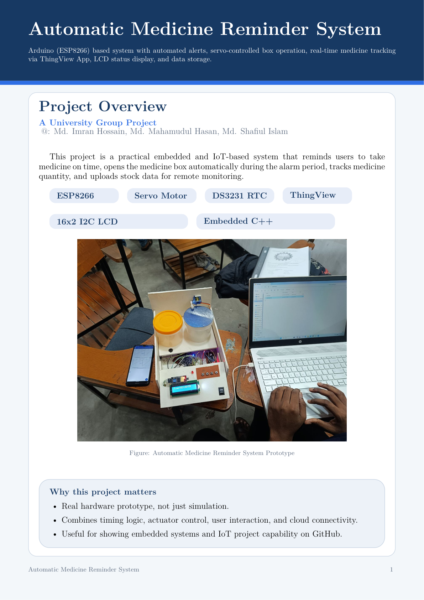

# Automatic Medicine Reminder System

👉 **[View Full Project Report (PDF)](./About.pdf)**

## Quick Summary
An IoT-based medicine reminder system built with ESP8266, DS3231 RTC, servo motor, buzzer, LED, LCD, and ThingView support for real-time monitoring.

### Features
- Scheduled medicine reminder using RTC
- Automatic medicine box opening with servo motor
- Alarm stop button and medicine taken detection
- Medicine stock update and refill support
- LCD-based real-time status display
- Cloud-connected monitoring through ThingView

## Documentation
For detailed explanation, hardware connections, circuit summary, and software logic, open the PDF above.
